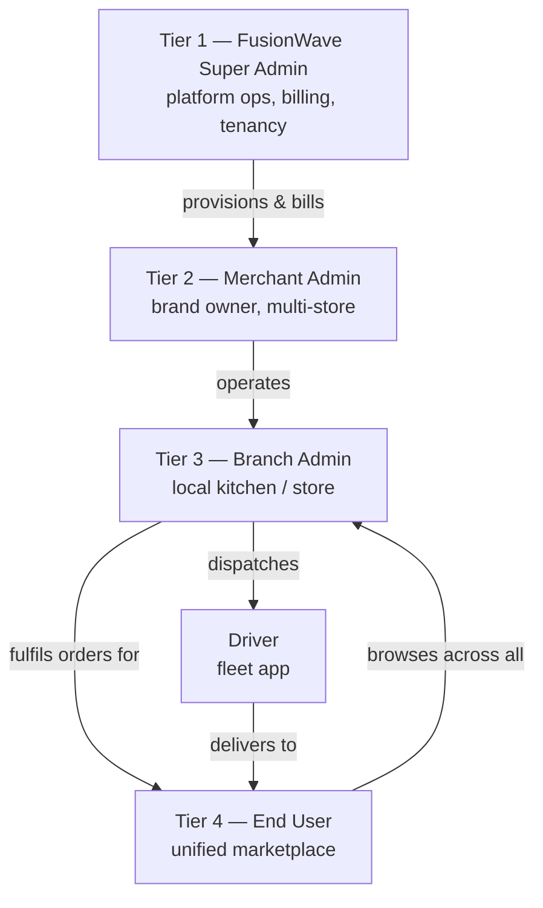
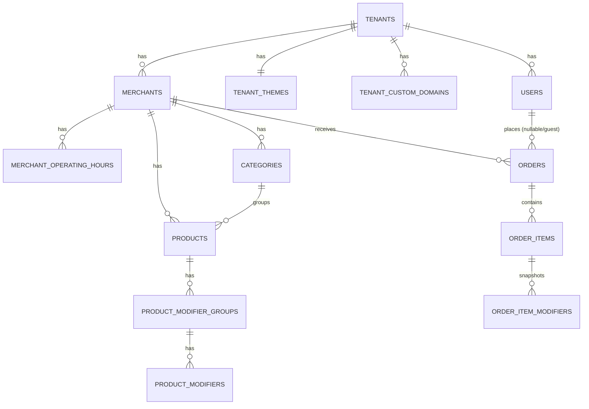
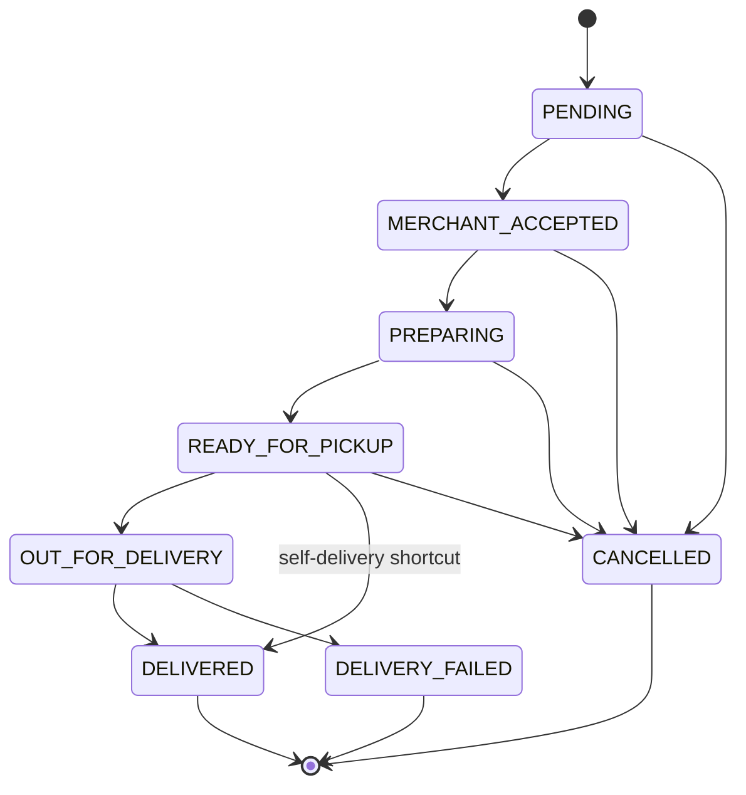
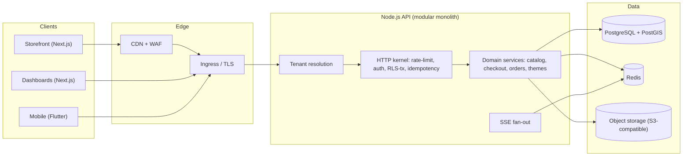
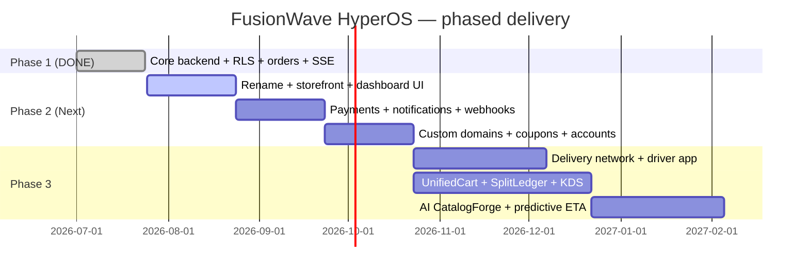

# FusionWave HyperOS — Master Project Document

> **Prepared by:** FusionWave Web Team
> **Audience:** CEO / Executive sign-off, Engineering, Product, Growth
> **Status:** Living document — v0.1
> **Working codename in repo:** `Hyperzod` (to be renamed — see §1)

---

## Document control & honesty legend

This document mixes **what already exists and has been verified running** with
**what is planned**. Every functional line is tagged so nothing is oversold to
the executive team:

| Tag | Meaning |
| --- | --- |
| ✅ **BUILT** | Implemented and verified against a live server this cycle |
| 🟡 **PARTIAL** | Foundation exists; needs completion |
| ⬜ **PLANNED** | Designed on paper only; not yet built |

**A note on the numbers.** All financial figures in §13–§14 are *illustrative
projections* based on stated assumptions, not booked results. They exist to
frame a business case and must be validated against real quotes and a pilot
before any commitment. Nothing here is legal or accounting advice.

---

## 0. Executive summary (the one-page pitch)

**FusionWave HyperOS** is a premium, multi-tenant SaaS operating system for
quick-commerce and hyperlocal delivery — purpose-built for the messy realities
of **restaurants, grocery, pharmacy, and multi-brand marketplaces** that generic
platforms treat as an afterthought.

Where competitors stop at "list a store, take an order," HyperOS goes deeper:

- **One customer, every nearby store.** A unified marketplace where a shopper
  drops a pin and checks out across *multiple merchants and branches* in a
  single basket.
- **Restaurant-grade operations.** Kitchen Display System routing, modifier
  logic, and live order lifecycle — not a bolted-on menu list.
- **Money done right.** Multi-party split billing: item cost, packaging, tips,
  platform commission, and multi-region tax cleanly separated in one
  transaction.
- **Dual-fleet dispatch.** In-house drivers, third-party logistics fallback, or
  platform-pooled routing — switchable per branch.
- **AI onboarding.** A merchant uploads a menu photo or spreadsheet and the
  catalog builds itself, cutting onboarding from days to minutes.

**Why now, why us.** The core transactional engine is **already built and
running** — multi-tenant isolation enforced at the database level, exact
server-side pricing, a guarded order state machine, live merchant order feed,
and guest checkout — on a **100% open-source stack** (Node.js, PostgreSQL +
PostGIS, Redis) that lets FusionWave undercut incumbent per-order pricing while
keeping healthier margins.

**The ask.** Approve Phase 2 funding to extend the proven foundation into the
full four-tier marketplace and take the first paying merchants live.

---

## 1. Legal compliance & clean-room / IP framework

> Not legal advice. This section defines *engineering and branding practices*
> that reduce IP risk. A qualified IP attorney must review before launch.

### 1.1 The rename (do this first)

The repository and its context docs currently use the codename **`Hyperzod`**,
which is a **competitor's registered brand**. The existing
`HYPERZOD_MASTER_CONTEXT.md` already flags this verbatim:

> *"continuing to use a competitor's name in your own codebase creates IP and
> brand-confusion risk … Recommend renaming."*

**Action:** rename the product, package namespaces, database, and all
user-facing strings to **FusionWave HyperOS** before external exposure.

| Layer | From | To |
| --- | --- | --- |
| Product name | Hyperzod | FusionWave HyperOS |
| npm scope | `@hyperzod/*` | `@fusionwave/*` |
| DB / service names | `hyperzod` | `hyperos` |
| Webhook headers | `X-Hyperzod-*` | `X-FusionWave-*` |
| Session cookie | `hzsid` | `fwsid` |

### 1.2 Clean-room directive

- **No decompilation, scraping, or reuse** of any competitor's code, assets,
  copy, or database structure. All source is written from first principles
  against our own specification documents.
- Feature *ideas* are not copyrightable; *expression* is. We implement the
  concepts (dispatch, geofencing, KDS) with our **own code and our own UI**.
- **Original terminology** for our differentiators, to build our own brand
  equity and avoid trade-dress confusion:

| Generic concept | FusionWave original term |
| --- | --- |
| Automated dispatch | **WaveDispatch** |
| Cross-store single basket | **UnifiedCart** |
| AI catalog builder | **CatalogForge** |
| Geofence engine | **ZoneWeave** |
| Multi-party ledger | **SplitLedger** |
| KDS routing | **PrepFlow** |

### 1.3 Freedom to operate (FTO) checklist

- [ ] Trademark search + registration for "FusionWave HyperOS" in launch region.
- [ ] Confirm all dependencies are permissively licensed (MIT/Apache/BSD/PostgreSQL).
- [ ] No GPL/AGPL code linked into the proprietary SaaS core.
- [ ] Original UI kit / design tokens (no copied competitor screens).
- [ ] Privacy policy + ToS drafted before collecting customer PII.
- [ ] Attorney sign-off on the above.

---

## 2. Product vision & competitive positioning

### 2.1 Coverage — "more areas than the incumbents"

| Vertical | HyperOS | Notes |
| --- | --- | --- |
| Restaurants & QSR | ✅ core focus | modifiers, KDS, table/QR ordering |
| Grocery & supermarket | ⬜ planned | bulk catalog, weight-based pricing |
| Pharmacy | ⬜ planned | prescription flag, compliance hold |
| Bakery / flowers / retail | ⬜ planned | same catalog model |
| Multi-brand marketplace | ⬜ planned | UnifiedCart across merchants |
| Ghost kitchens | ⬜ planned | many brands, one branch/location |

### 2.2 Differentiation vs. a generic incumbent

| Capability | Generic incumbent | FusionWave HyperOS |
| --- | --- | --- |
| Pricing integrity | client-trusted totals common | ✅ server re-derives every cent |
| Tenant isolation | app-layer filters | ✅ **database-enforced (RLS)** |
| Cross-store checkout | rare | ⬜ UnifiedCart (designed) |
| Split billing | limited | ⬜ SplitLedger (designed) |
| Dispatch | single mode | ⬜ dual-fleet + 3PL fallback |
| Onboarding | manual | ⬜ CatalogForge AI |
| Cost model | proprietary infra | ✅ open-source, lower unit cost |

---

## 3. Personas & the four-tier hierarchy



| Persona | Surface | Primary jobs |
| --- | --- | --- |
| Super Admin | Control center (web) | tenancy, subscriptions, commissions, global fleet/3PL toggles, platform analytics |
| Merchant Admin | Dashboard (web) | menu, inventory, tax profiles, storefront branding, ledgers, campaigns |
| Branch Admin | Ops board (web/tablet) | live orders, KDS, geofence, printer, local stock, driver handoff |
| End User | Marketplace (web + mobile) | discover nearby, browse, UnifiedCart, checkout, track |
| Driver | Driver app (mobile) | accept, navigate, proof of delivery, payouts |

---

## 4. Software Requirement Specification (SRS)

### 4.1 Tier 1 — Super Admin (FusionWave Control Center)

| Requirement | Status |
| --- | --- |
| Tenant provisioning (create brand + owner + starter store) | ✅ BUILT (signup flow) |
| Multi-tenant data isolation | ✅ BUILT (Postgres RLS, forced) |
| Two operational DB roles (app vs. control-plane) | ✅ BUILT |
| Subscription tiers & SaaS billing engine | ⬜ PLANNED |
| Platform-wide commission / transaction fee config | ⬜ PLANNED |
| Global 3PL / carrier toggles | ⬜ PLANNED |
| Cross-tenant analytics & system logs | 🟡 PARTIAL (request logging built) |

### 4.2 Tier 2 — Merchant Admin (brand owner)

| Requirement | Status |
| --- | --- |
| Auth (JWT access + refresh, rotation) | ✅ BUILT |
| Categories CRUD | ✅ BUILT |
| Products CRUD (integer-cents pricing) | ✅ BUILT |
| Modifier groups & modifiers (SINGLE/MULTIPLE, min/max, required) | ✅ BUILT |
| Storefront theming (colors, fonts, hero, CDN-guarded assets) | ✅ BUILT |
| Merchant settings (accepting-orders snooze, prep time) | ✅ BUILT |
| Multi-store aggregation dashboard | ⬜ PLANNED |
| Ingredient-level inventory matrix | ⬜ PLANNED |
| Automated multi-region tax profiles | ⬜ PLANNED |
| Financial ledgers / settlement | ⬜ PLANNED |
| Marketing campaigns / coupons | ⬜ PLANNED |

### 4.3 Tier 3 — Branch Admin (local unit)

| Requirement | Status |
| --- | --- |
| Live incoming order feed (real-time) | ✅ BUILT (SSE with reconnect replay) |
| Accept / reject / prepare / ready lifecycle | ✅ BUILT (guarded FSM) |
| Cancel with reason | ✅ BUILT |
| Order search / history (paginated) | ✅ BUILT (keyset pagination) |
| Weekly operating hours | 🟡 PARTIAL (table + model exist) |
| KDS with prep-station routing (PrepFlow) | ⬜ PLANNED |
| Thermal printer (ESC/POS over WebSocket) | ⬜ PLANNED |
| Live geofence polygon editing (ZoneWeave) | ⬜ PLANNED (PostGIS ready) |
| Local courier / dispatch handoff | ⬜ PLANNED |

### 4.4 Tier 4 — End User (unified marketplace)

| Requirement | Status |
| --- | --- |
| Storefront bootstrap (tenant, merchant, theme) | ✅ BUILT |
| Menu browse by category with modifiers | ✅ BUILT (ETag-cached) |
| Anonymous session cart (server-priced) | ✅ BUILT |
| Guest checkout (email + phone, no account) | ✅ BUILT |
| Order status tracking (token or session) | ✅ BUILT |
| Location-based multi-merchant discovery | ⬜ PLANNED (PostGIS radius) |
| UnifiedCart across merchants | ⬜ PLANNED |
| Registered accounts, reorder, favorites | ⬜ PLANNED |
| Live driver map tracking | ⬜ PLANNED (WebSocket gateway spec'd) |

### 4.5 Driver app

| Requirement | Status |
| --- | --- |
| Accept assignment, navigation, proof of delivery | ⬜ PLANNED |
| Live location streaming | 🟡 PARTIAL (tracking gateway spec exists) |
| Payout breakdown | ⬜ PLANNED |

---

## 5. Non-functional requirements

| Attribute | Target |
| --- | --- |
| Tenant isolation | Database-enforced (RLS), fail-closed |
| Pricing integrity | Server-authoritative; client never sets price |
| Availability | 99.9% API; graceful SSE reconnect |
| Latency | p95 < 200 ms for storefront reads (cached) |
| Money representation | Integer minor units (cents) everywhere |
| Idempotency | Safe retries on checkout/transition/writes |
| Rate limiting | Per-tenant token buckets per route group |
| Observability | Structured logs, request IDs, health/readiness |
| Security | CSRF (session), JWT (dashboard), HMAC webhooks |

---

## 6. Software Design Document (SDD) — architecture & stack

### 6.1 Tech stack

| Layer | Choice | Status |
| --- | --- | --- |
| Backend runtime | **Node.js 20+ / TypeScript (strict)** | ✅ BUILT |
| HTTP framework | **Express** (hand-wired kernel: guards→middleware, DI→composition root) | ✅ BUILT |
| Database | **PostgreSQL 15+ / PostGIS** | ✅ BUILT (running on 17) |
| Cache / sessions / pub-sub | **Redis 7+** | ✅ BUILT |
| ORM / data access | **TypeORM** + raw SQL on control plane | ✅ BUILT |
| Real-time (merchant) | **SSE** (order feed) | ✅ BUILT |
| Real-time (driver) | **Socket.io / WebSocket** | ⬜ PLANNED |
| Frontend (storefront) | **Next.js 15 (App Router, RSC)** | ⬜ PLANNED |
| Frontend (dashboards) | **Next.js / React + Tailwind + shadcn/ui** | ⬜ PLANNED |
| Mobile (customer/driver) | **Flutter** (per roadmap) | ⬜ PLANNED (Phase 3) |
| UI polish | Tailwind, shadcn/ui, Framer Motion | ⬜ PLANNED |

> **Note on framework.** The backend was delivered on **raw Express + TypeScript**
> (not NestJS) by explicit request. NestJS building blocks were hand-ported: DI →
> a composition root, guards/interceptors → an HTTP kernel wrapper, `@nestjs/jwt`
> → a small `jsonwebtoken` service. Module boundaries remain clean so a future
> framework migration is mechanical.

### 6.2 Multi-tenancy model (the load-bearing decision) — ✅ BUILT

- Shared database, shared schema, **row-scoped by `tenant_id`**.
- **Row-Level Security ENABLED + FORCED** on every business table.
- Policies compare `tenant_id` against a per-transaction GUC
  (`app.current_tenant`) set inside `BEGIN … SET LOCAL … COMMIT`.
- Two DB roles: `app_runtime` (NOBYPASSRLS, every request) and `platform_admin`
  (BYPASSRLS, only host→tenant resolution and signup).
- Composite foreign keys `(tenant_id, id)` make a cross-tenant reference
  *structurally impossible*, not just filtered.

```mermaid
sequenceDiagram
    participant C as Client
    participant MW as Tenant Middleware
    participant K as HTTP Kernel
    participant PG as PostgreSQL (RLS)
    C->>MW: request (Host or JWT)
    MW->>MW: resolve tenantId → AsyncLocalStorage
    K->>PG: BEGIN; SET LOCAL app.current_tenant
    K->>PG: handler queries (RLS-filtered)
    K->>PG: COMMIT
    K-->>C: { data, meta } envelope
    Note over K: buffered domain events flushed AFTER commit
```

### 6.3 Real-time fan-out — ✅ BUILT (merchant), ⬜ PLANNED (driver)

- Order events buffered per request, emitted **after commit**, published to a
  Redis channel and a bounded replay LIST per `(tenant, merchant)`.
- Every process subscribes for its locally connected SSE clients; browser
  reconnects with `Last-Event-ID` and replays missed events, with a
  `catchup_gap` fallback to a REST refetch.

---

## 7. Data model (ERD)



**Design invariants (✅ BUILT):**
- Every business row carries `tenant_id NOT NULL` with an RLS policy.
- Money columns are `bigint` cents; a `currency_code` travels with each row.
- Order line items and modifiers are **immutable snapshots** — renaming or
  re-pricing a product never rewrites order history.
- Order numbers are monotonic per merchant per local business day
  (`ORD-YYYYMMDD-NNNNN`) via an atomic counter.

**Planned tables (⬜):** `webhook_endpoints`, `coupons`, `inventory_items`,
`split_ledger_entries`, `driver_assignments`, `delivery_zones` (geometry),
`subscriptions`, `invoices`.

---

## 8. Order state machine — ✅ BUILT

Enforced in **three places**: a Postgres enum, an authoritative
`enforce_order_status_transition()` trigger, and a TypeScript mirror that
returns a clean `409` instead of a raw SQL error.



Verified live: legal transitions set lifecycle timestamps automatically;
illegal edges return `409 ORDER_INVALID_TRANSITION`; `CANCELLED`/`DELIVERY_FAILED`
require a reason (`422` otherwise).

---

## 9. System architecture



Deployment posture: **modular monolith now**, module boundaries drawn so
extraction to services is mechanical when scale demands it.

---

## 10. Key flow — checkout (UnifiedCart target)

```mermaid
sequenceDiagram
    participant U as Customer
    participant API as HyperOS API
    participant PG as PostgreSQL
    U->>API: POST /checkout {items: ids+qty, no prices}
    API->>PG: load products + modifiers (RLS scoped)
    API->>API: re-derive unit price = base + Σ modifier deltas
    API->>API: validate modifier rules (required/min/max)
    API->>PG: BEGIN; insert order+items+modifiers; allocate order#; COMMIT
    API-->>U: 201 { order } (server totals)
    API-)API: emit order.created (post-commit) → SSE + webhooks
```

---

## 11. API gateway & cross-store routing

- All endpoints under `/api/v1/`; storefront vs. dashboard split by host.
- Storefront tenant resolved from `Host` (subdomain or custom domain);
  dashboard tenant from the JWT claim.
- **UnifiedCart (⬜ PLANNED):** a marketplace checkout that fans a single basket
  into per-merchant sub-orders, each entering its own state machine, with
  SplitLedger apportioning totals. Designed on top of the existing per-merchant
  order engine — additive, not a rewrite.

---

## 12. Security & compliance

| Control | Status |
| --- | --- |
| RLS tenant isolation (forced) | ✅ BUILT |
| CSRF double-submit (storefront sessions) | ✅ BUILT |
| JWT access/refresh with rotation | ✅ BUILT |
| scrypt password hashing (memory-hard) | ✅ BUILT |
| Rate limiting (Redis token buckets) | ✅ BUILT |
| Idempotency keys | ✅ BUILT |
| Webhook HMAC signing + SSRF guards | ⬜ PLANNED (contract spec'd) |
| PII minimization / retention policy | ⬜ PLANNED |
| PCI scope (offload to gateway) | ⬜ PLANNED |

---

## 13. Cost model — maximum quality via open source

**Thesis:** by standing on best-in-class open source instead of proprietary
managed spatial/analytics products, HyperOS runs at materially lower unit cost,
which we pass on as lower merchant pricing while keeping better margins.

| Function | Open-source choice | Proprietary alt (avoided) |
| --- | --- | --- |
| Database + geo | PostgreSQL + PostGIS (self-host / Supabase OSS) | managed spatial DBs |
| Cache / realtime | Redis / Valkey | managed pub-sub |
| Maps / geocoding | OpenStreetMap + Leaflet (Google as paid upgrade) | Google Maps at scale |
| Analytics / logs | PostHog OSS + OpenTelemetry | per-seat SaaS analytics |
| Object storage | S3-compatible (R2 / Wasabi / MinIO) | premium egress tiers |
| Email/SMS | provider free tiers → pay-as-you-grow | bundled comms |

### 13.1 Illustrative infrastructure cost (early stage)

> Illustrative monthly ranges, single region, pre-scale. Validate with quotes.

| Item | Est. monthly (USD) |
| --- | --- |
| App compute (2× small nodes) | $40–$80 |
| Managed/self-host Postgres+PostGIS | $25–$60 |
| Redis | $10–$25 |
| Object storage + CDN | $10–$30 |
| Maps (OSM tiles / light usage) | $0–$20 |
| Email/SMS (starter volumes) | $0–$40 |
| **Total** | **~$95–$255 / mo** |

The point for the CEO: **the floor is double-digit dollars**, not thousands,
because the heavy components are open source and self-hostable.

---

## 14. SaaS pricing & profit model

### 14.1 Merchant pricing tiers (illustrative)

| Tier | Target | Monthly | Transaction fee |
| --- | --- | --- | --- |
| **Starter** | single store | low flat fee | small % or flat per order |
| **Pro** | multi-store brand | mid flat fee | lower % |
| **Marketplace** | multi-vendor operator | higher flat + platform share | negotiated |

Strategy: **undercut incumbent per-order economics** with a flat-fee-leaning
model, so a high-volume merchant's cost is predictable and lower than a pure
percentage competitor.

### 14.2 Revenue lines

1. Recurring subscription (primary, high-margin).
2. Optional payment-processing share via SplitLedger.
3. Premium add-ons: 3PL routing, advanced analytics, AI catalog volume, custom
   domains.

### 14.3 Illustrative 12-month trajectory (assumption-driven)

> Assumes conservative merchant acquisition and blended ARPU. Replace with real
> pilot data before board use.

| Quarter | Merchants (cum.) | Notes |
| --- | --- | --- |
| Q1 | pilot (single digits) | design partners, free/discounted |
| Q2 | tens | Starter/Pro conversions |
| Q3 | low hundreds | referral + POS partnerships |
| Q4 | scaling | first Marketplace tenant |

Because infrastructure cost per additional merchant is near-flat until real
scale, **gross margin expands with each tenant** — the classic SaaS curve, made
steeper by the open-source cost base.

---

## 15. Go-to-market & marketing plan

### 15.1 Beachhead

Target the segments incumbents serve worst: **independent multi-brand restaurant
groups, ghost kitchens, and local pharmacy/grocery networks** that need real
operational depth (KDS, split billing, dual-fleet) — not just a menu page.

### 15.2 Positioning

- **"Onboard in minutes, not days"** — CatalogForge AI menu import.
- **"Every nearby store, one basket"** — UnifiedCart.
- **"The operational OS, not just an order form"** — KDS, SplitLedger,
  WaveDispatch.
- **"Predictable, lower pricing"** — flat-fee-leaning, open-source cost base.

### 15.3 B2B acquisition funnel

1. Self-serve trial (14 days, no card) → AI-assisted setup.
2. POS integration partnerships for warm distribution.
3. Local field outreach to restaurant groups + pharmacy chains.
4. Design-partner program: discounted Pro in exchange for case studies.

### 15.4 Channels

Founder-led sales for anchor tenants; content/SEO via the Next.js marketing site;
regional partnerships; referral incentives inside the merchant dashboard.

---

## 16. Delivery roadmap



| Phase | Outcome | Status |
| --- | --- | --- |
| **1 — Foundation** | Multi-tenant backend, order engine, live feed, guest checkout | ✅ BUILT & VERIFIED |
| **2 — Go-to-market** | Rename, storefront + dashboards UI, payments, notifications, webhooks, custom domains, coupons, customer accounts | ⬜ NEXT |
| **3 — Scale & moat** | Delivery/driver network, UnifiedCart, SplitLedger, KDS/PrepFlow, AI CatalogForge, mobile apps | ⬜ PLANNED |

---

## 17. Deployment & DevOps

| Concern | Plan | Status |
| --- | --- | --- |
| Local dev | Docker Compose (Postgres+PostGIS, Redis) or Homebrew | ✅ BUILT (both paths) |
| Schema | Authoritative `schema.sql`, idempotent apply script | ✅ BUILT |
| Seed | Demo tenant + login | ✅ BUILT |
| Config | Fail-fast env validation on boot | ✅ BUILT |
| Health/readiness | `/health`, `/health/ready` (checks PG+Redis) | ✅ BUILT |
| Graceful shutdown | SIGTERM/SIGINT drain | ✅ BUILT |
| CI/CD | GitHub Actions → build/test → container → deploy | ⬜ PLANNED |
| Hosting | Containers on a cost-effective provider; managed PG optional | ⬜ PLANNED |
| TLS / domains | Wildcard for subdomains; on-demand for custom domains | ⬜ PLANNED |
| Backups / DR | Nightly PG dumps + PITR | ⬜ PLANNED |

---

## 18. Team & effort (indicative)

| Role | Phase 2 focus |
| --- | --- |
| 1–2 Backend (Node/TS) | payments, webhooks, notifications, accounts |
| 2 Frontend (Next.js) | storefront + 3 dashboards, design system |
| 1 Mobile (Phase 3) | Flutter customer/driver |
| 0.5 DevOps | CI/CD, hosting, observability |
| 0.5 Product/PM | scope, merchant pilots |

---

## 19. Risk register

| Risk | Likelihood | Impact | Mitigation |
| --- | --- | --- | --- |
| Brand/IP (competitor name in code) | High | High | **Rename now** (§1); attorney FTO review |
| Payments/region undecided blocks checkout $ | Med | High | Decide launch region → gateway early in Phase 2 |
| 3PL API dependencies | Med | Med | Abstraction layer; in-house fleet fallback |
| Multi-region tax complexity | Med | Med | Tax-profile engine; start single region |
| Realtime scale (SSE fan-out) | Low | Med | Redis pub/sub + bounded replay (built); shard later |
| Over-scope before revenue | High | High | Ship Phase 2 to paying pilots before Phase 3 |

---

## 20. Appendix — what is real today (verified this cycle)

Proven against a live server (`/health/ready` → `postgres: ok, redis: ok`):

- ✅ Tenant provisioning (signup) + RLS isolation (forced) on all tables.
- ✅ Dashboard auth: login → JWT (`TENANT_ADMIN`), refresh rotation.
- ✅ Storefront bootstrap, menu (ETag), product detail.
- ✅ Server-side pricing verified exact: base 40000 + Large 10000 + Oat 5000 +
  Shot 7000 = **62000/unit × 2 = 124000** total; order `ORD-20260724-00001`.
- ✅ Order FSM: `PENDING → MERCHANT_ACCEPTED` (timestamp auto-set); illegal
  `→ DELIVERED` returns `409`; cancel without reason returns `422`.
- ✅ Live merchant order feed (SSE) with reconnect replay.
- ✅ Catalog CRUD, theming with CDN/hex/font validation.
- ✅ Rate limiting, idempotency, `{data}`/`{error}` envelopes.
- ✅ 14 automated pricing/modifier tests passing.

**Stack as built:** Node.js + Express + TypeScript, PostgreSQL 17 + PostGIS,
Redis — 100% open source.

---

*End of master document v0.1. Next action for sign-off: approve the rename and
Phase 2 scope so the storefront/dashboard UI and payments work can begin.*
